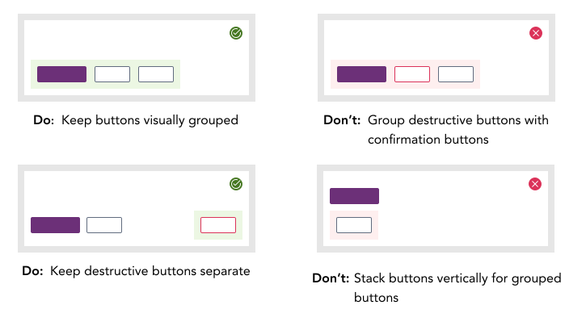

import AdmonitionExt from '../admonitionExt'

> A button or Call to Action (CTA) button, depending on the situation, will usually prompt users to sign up/register/buy now etc. CTA buttons should be used where the platfrom wants to strongly suggest something that the user should do.

<!-- Types of buttons available -->
## Variants

There are several types of Buttons with varying degree of emphasis. Emphasis determines a Button's appearance and placement.

<!-- When to use the varients -->
## Usage

| Type         | Emphasis | When to use | 
| --          | ------- | ----------- | 
| Primary     | High | Use to draw attention to the primary action on a screen. There should be only one Primary Button on a page at a time. Not all screens require a Primary Button. |
| Secondary   | Medium | Use for secondary actions on a screen. Secondary Buttons can be used on most pages without constrictions.  |
| Danger      | High | Use to let users know they have an option to delete or remove data. They commonly appear in confirmation dialogs as the final confirmation before deleting. |
| Link button | Low | Use for actions that are less crucial. Tertiary Buttons are not links. They have focus states and are designed with a container. Always have a label that clearly communicates what action will occur if a user clicks or taps the button. |

## Sizes

<!-- Guidelines on how to use them -->
## Guidance

* The buttons should be discoverable, easy to identify, and specific.
* Always have a text label within the button container. 
* Avoid using buttons with icons on either side of the text. Only one icon should be used in either case with the text in the button.
* If using multiple buttons, style and label them distinctly.
* Icons are optional. When icons are used in a button, the default button has icon size of SM(16x16px) while the large and block buttons have icon size of Default(24x24px).
* The icon color should same as the text color used for the button text. 
* Make buttons look and feel clickable.

### When to use

* Buttons should indicate an action is being performed.

### When not to use

* If you are directing a user to a new location, consider using a [link](../buttons-and-links/links.md) element.

<!-- Alignment Section -->
## Alignment

Buttons can be aligned left, right, or center depending on the context. Multiple alignments can be combined within a single screen, but not within an individual context. As a pattern, button placement in GEL for the primary actionable items are right aligned in most scenarios.

* **Right alignment:** In constrained containers like modals and dialogs, flows that continue in a progressive direction, actions with a global impact, and toolbars. In these instances a Z-pattern (top to bottom and left to right with a diagonal, scanning movement) is common for reading flow. In these instances a user may be taking a progressive action, like affirming a modal, or an action upon a section, like formatting text in a comment.

* **Center alignment:** Buttons used in empty states are the most ideal scenario to use center alignment. The actions are the only ones available in the context. Keep in mind if the actions navgiates user to another page, use [link](./links.md) instead.

### Considerations

<!-- Assets in Figma and PrimeVue -->
## Designer assets

<AdmonitionExt type="figma" url="https://www.figma.com/file/kzLxtqv6YGL0wotiqzgEo4/GEL-UI-Doc?node-id=2%3A34946" />

## Developer API

<AdmonitionExt type="vue" url="https://primefaces.org/primevue/button" />

