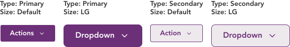
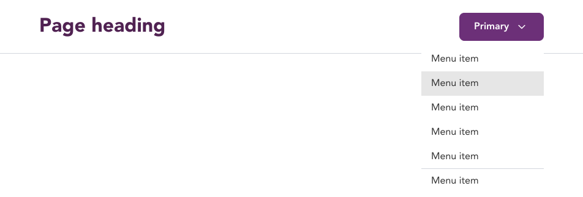

import AdmonitionExt from '../admonitionExt'

> Dropdown buttons are CTAs that trigger displaying additional options to the user.

## Variants

There are four different vairants of dropdown available in GEL. 

## Demo

## Guidance

* Dropdown buttons can be used to display additional actionable items within the button.
* You can use a dropdown button if the actionable items needs to be displayed upon clicking the button.
* A dropdown button is ideally complemented with tiered menu item as the options are trigger actions rather than just options as in listbox.

### When to use

* Use dropdown when all the actions can be inside a parent button and does not require the user to have a default action.

### When not to use

* Consider using a split button if you want a default action available without opening the list of options.

## Designer assets

<AdmonitionExt type="figma" url="https://www.figma.com/file/kzLxtqv6YGL0wotiqzgEo4/GEL-UI-Doc?node-id=2452%3A137506&t=TGRoM1Kxa2D9XZlV-4" />

## Developer API

<AdmonitionExt type="vue" url="https://primefaces.org/primevue/dropdown" />

