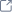

import AdmonitionExt from '../admonitionExt'

> A Link usually will navigate the user away from the current screen.

## Variants

There are three different vairants of links available in GEL. 

## Guidance

* A link would navigate the user away from the current page without any modification done to the website.
* Use links when texts preceds or follow the link. - e.g. "Don't have an account? Sign up". Avoid using "Click here" only as the means of communication when using links.
* Text in a link can be longer than that of button.
* A link that navigates user to an external link should be appended with a external icon to communicate the purpose to the users. For example  [Learn more about PrimeVue  ](https://primefaces.org/primevue/setup) 

### When to use

* Links should be used when the user is redirected to another location.
* Links are used for navigation and the action do not affect the website.

### When not to use

* Consider using a button for actions such as submitting form or triggering a modal or changing elements of a website.

## Designer assets

<AdmonitionExt type="figma" url="https://www.figma.com/file/kzLxtqv6YGL0wotiqzgEo4/GEL-UI-Doc?node-id=6%3A16646" />

## Developer API

:::caution Code

Link is a custom component specific to GEL and is not available in PrimeVue.

:::