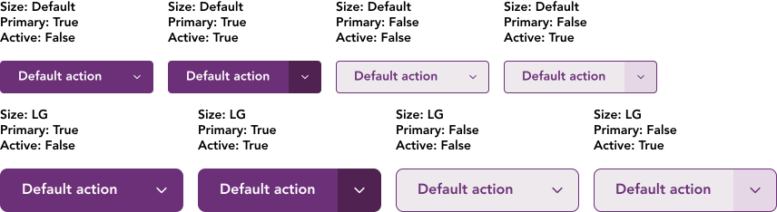
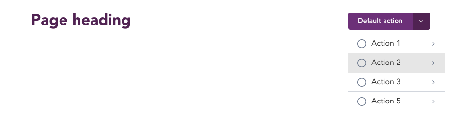
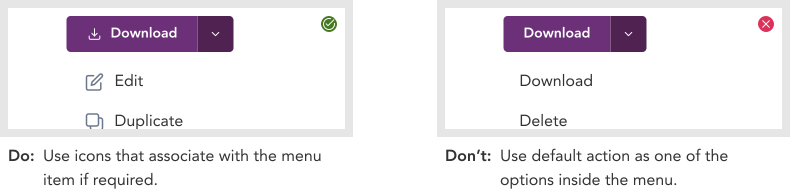

import AdmonitionExt from '../admonitionExt'
import Video from '../video'

> Split buttons are CTAs that trigger additional options similar to dropdown buttons but differs in the functionality part where split button always has a default action while dropdown does not.

## Variants

There are eight different vairants of split buttons available in GEL. 

## Demo

## Guidance

* Secondary split buttons are for actions that are of less value similar to secondary button but with additional actionable items.
* Similar to dropdown buttons, consider using a tiered menu when the user selects or clicks the dropdown icon.

### When to use

* Split buttons are to be used when an action needs to be a default action and other available actions can be organized inside the dropdown button.
<Video filename="split-button-behaviour.mp4" />

### When not to use

* If there is no default action and all the options has the same weightage in priority, consider using a [dropdown](dropdown.md) instead.

### Consideration

## Designer assets

<AdmonitionExt type="figma" url="https://www.figma.com/file/kzLxtqv6YGL0wotiqzgEo4/GEL-UI-Doc?node-id=2476%3A136558&t=Ht6kZ6wwVXbMpld4-4" />

## Developer API

<AdmonitionExt type="vue" url="https://primefaces.org/primevue/splitbutton" />

