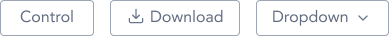
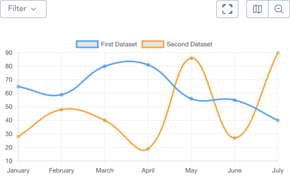

> Button controls are CTAs that are used to trigger events in infographics and tables.

## Variants

A total of three button controls are available in GEL.

## Demo

## Guidance

* Button control are actionable items that can be used for infographics/charts and tables.
* Button control are similar to Toolbar but differs in the fact that it acts a sole actionable item rather than group.

## When to use

* Button control can be used in cohesion with Segmented control and Toolbar for infographics/charts and tables.