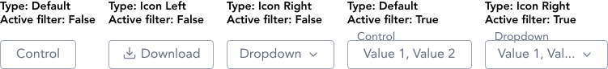

import AdmonitionExt from '../admonitionExt'

> Button controls are CTAs that are used to trigger events in infographics and tables.

## Variants

A total of three button controls are available in GEL.

## Demo

## Guidance

* Button control are actionable items that can be used for infographics/charts and tables.
* Button control are similar to Toolbar but differs in the fact that it acts a sole actionable item rather than group.
* Button control with dropdown can be clicked like any other CTAs but it will show the list of options upon click without the ability to type.
* The gap between control-buttons on the same line is spacer-2.

### When to use

* Button control can be used in cohesion with Segmented control and Toolbar for infographics/charts and tables.

## Designer assets

<AdmonitionExt type="figma" url="https://www.figma.com/file/kzLxtqv6YGL0wotiqzgEo4/GEL-UI-Doc?node-id=677%3A67323" />

## Developer API

<AdmonitionExt type="vue" url="https://primefaces.org/primevue/button" />