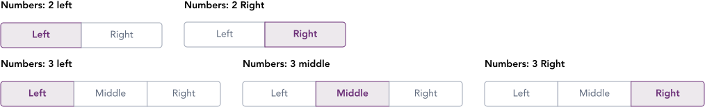
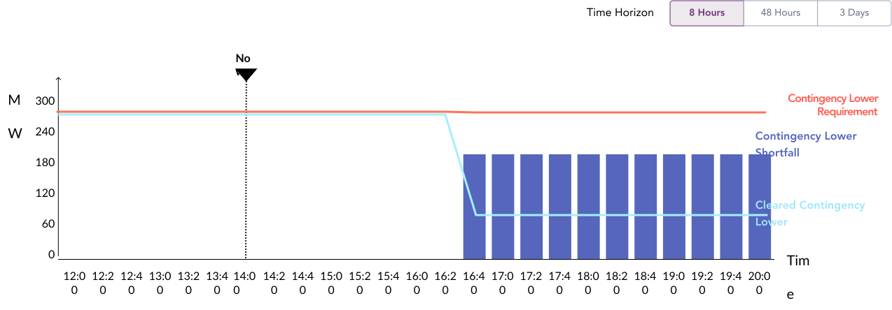

import AdmonitionExt from '../admonitionExt'

> A segmented control changes the view of the given infographic.

## Variants

A total of five different segmented-controls are available in GEL.

## Demo

## Guidance

* Segmented Control stay in cohesion with toolbars. They can be used in the same level as toolbar making them right aligned when used in infographics/charts.
* Segmented control changes a view of a chart or table based on the selection made by the user.
* A maximum of 4 options can be used as required when creating a segmented control.
* Results after using a segmented control is effective immediately.
* Use short and consize naming convention enabling all the widths of the segment-control to be equal. Consider using a toolbar if the text is too long.
* The gap between control-buttons on the same line is spacer-2.

### When to use

* Use segmented control when the user requires clear text displayed at all times.

## Designer assets

<AdmonitionExt type="figma" url="https://www.figma.com/file/kzLxtqv6YGL0wotiqzgEo4/GEL-UI-Doc?node-id=677%3A67525" />

## Developer API

<AdmonitionExt type="vue" url="https://primefaces.org/primevue/selectbutton" />