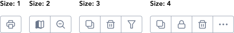
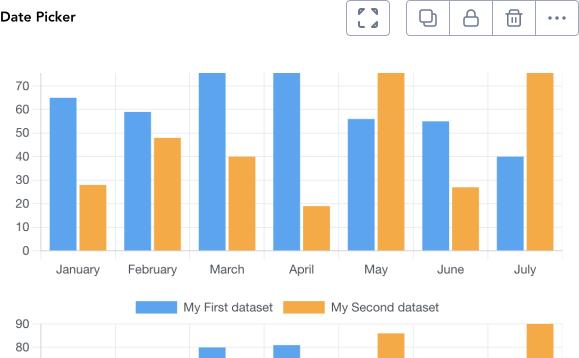

import AdmonitionExt from '../admonitionExt'

> Toolbar is a group of  buttons or icons put together to have multiple actionable items in a place.

## Variants

A total of four different toolbars are available in GEL.

## Demo

## Guidance

* Toolbar are in genaral floated towards the right of the infographic/charts and tables.
* All icons should be accompanied with a tooltip.
* There can be multiple toolbars exisiting together with different functionalities.
* Additional actionable items/icon that are less important can be hidden under the ellipse sign.

## When to use

* Toolbar are uesd to add more actionable content to a given chart/infographic.

## Designer assets

<AdmonitionExt type="figma" url="https://www.figma.com/file/kzLxtqv6YGL0wotiqzgEo4/GEL-UI-Doc?node-id=677%3A66829" />

## Developer API

<AdmonitionExt type="vue" url="https://primefaces.org/primevue/toolbar" />