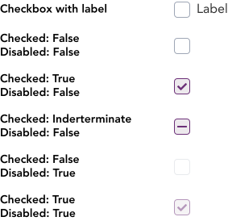
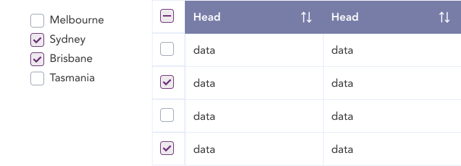

> A checkbox is an input control that allows a user to select one or more options from number of choices.

## Variants

There are a total of 6 variations of checkboxes available in GEL to choose from.

:::info Figma

See all the available variants of checkbox by clicking [here](https://www.figma.com/file/kzLxtqv6YGL0wotiqzgEo4/GEL-UI-Doc?node-id=696%3A97914)

:::
:::info Code

Find the source code [here](https://primefaces.org/primevue/checkbox)

:::

## Demo

## Guidance

* Checkboxes options ideally should be stacked vertically, however can be horizontally placed if the width is sufficient.
* All checkbox should be followed by text in a from.
* Users are able to select an option by clicking/tapping either the checkbox or its label.
* Consider using a Select if the options provided are more than 5.
* An intermediate state of checkbox can also be displayed when only some options are selected.

## When to use

* Checkboxes are used in a form or multiselect dropdown for a user to indicate a selection of one or more options.