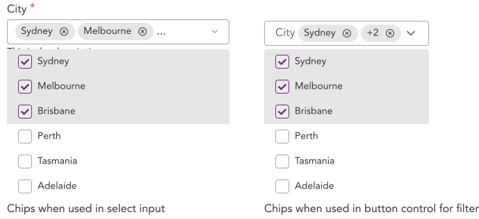

import AdmonitionExt from '../admonitionExt'

> Chip represents entities using icons and labels. Chips should appear dynamically as group of interactive elements.

## Variants

There is only one form of chip avaliable in GEL.

## Demo

## Guidance

* The Chips should have close button by default allowing users to delete the chips from the Select fields.
* The gap between two adjacent Chips inside an Input field and Select field should be equal to “Spacer 1”(4px) of the design token.
* The Select field will be appended with a “...” if the next Chips cannot fit in. 
* Chips when used in filter control for chart should take into consideration the width of the available space. Show 1 chip followed by the number of options selected to indicate the number of selections made for that  filter

### When to use

* Chips are majorly used in the select state and chart filter under button control.

## Designer assets

<AdmonitionExt type="figma" url="https://www.figma.com/file/kzLxtqv6YGL0wotiqzgEo4/GEL-UI-Doc?node-id=696%3A97147" />

## Developer API

<AdmonitionExt type="vue" url="https://primefaces.org/primevue/chips" />