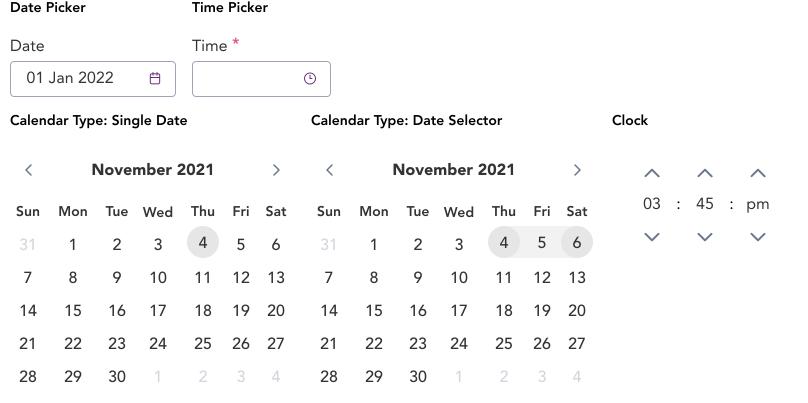

import AdmonitionExt from '../admonitionExt'

> A date and time picker allows the user to select an associated date and time.

## Variants

There are a total of 5 variations of date and time to choose from in GEL.

## Demo

## Guidance

* The selected time and date should be reflected in the input box for both date and time picker components.
* The time and calendar are displayed as dropdown upon clicking the icon in the selection area. User can type if they click in the input area instead of the icon.
* The placeholder indicates the behaviour in which the selected value will be displayed to the user.
* The icon in the date and time picker differentiates it from a regular text input even though the functionality are similar.
* Similar to the listbox, the calendar and timer should be display left aligned to the date or time picker with a margin of Spacer-1(4px) between them.
* Increase the width of the input field when a date range has been selected.

### When to use

* Use the date and time picker if the user wants to populate the given input field with either Date or Time.

## Designer assets

<AdmonitionExt type="figma" url="https://www.figma.com/file/kzLxtqv6YGL0wotiqzgEo4/GEL-UI-Doc?node-id=696%3A97823" />

## Developer API

<AdmonitionExt type="vue" url="https://primefaces.org/primevue/calendar" />