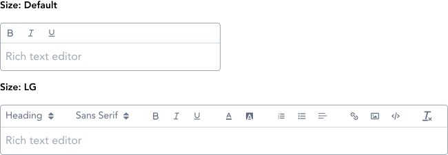
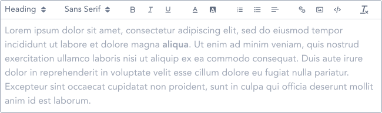

> Editors are rich text editor with additonal text formatting options.

## Variants

There are a total of 2 editor variations to choose from in GEL.

:::info Figma

See all the available variants of switch by clicking [here](https://www.figma.com/file/kzLxtqv6YGL0wotiqzgEo4/GEL-UI-Doc?node-id=696%3A97200)

:::
:::info Code

Find the source code [here](https://primefaces.org/primevue/editor)

:::

## Demo

## Guidance

* Editor in GEL is leveraged using the QUILL framework provided by PrimeVUE.
* Editor component is to be used a placeholder, however the icons for the rich text editor are provided by QUILL framework itself.

## When to use

* Use editor when the textarea requires rich editing options.