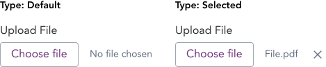

import AdmonitionExt from '../admonitionExt'

> A file uploader is used to upload files from a computer or device to the application.

## Variants

There is one file upload component available in GEL.

## Demo

## Guidance

* A single file upload component attaches one file at a time. Additional upload component can be used to add multiple files. 
* The attached file name will be displayed in File selection label area. If no files are selected, this area is displayed as “No file chosen”.
* The upload is triggered when the user submits the form.

## When to use

* When user needs to upload one or more files to the system.

## Designer assets

<AdmonitionExt type="figma" url="https://www.figma.com/file/kzLxtqv6YGL0wotiqzgEo4/GEL-UI-Doc?node-id=696%3A97882" />

## Developer API

<AdmonitionExt type="vue" url="https://primefaces.org/primevue/fileupload" />