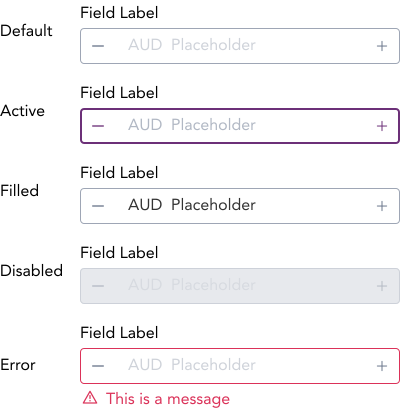

import AdmonitionExt from '../admonitionExt'

> Input numbers allows the user to input numeric value only.

## Variants

There are a total of 32 variations of input number to choose from. They are primarily divided into 4 different states (Default, Active, Disabled, and Error) of inputs.

| States | Sub States|
| ---    | ---       |
|  |  |

## Demo

## Guidance

* Input number are similar to Input fields but only take numbers as input value.
* When the user clicks any of the action button associated with the input field, the increased and decreased value should be reflected in the input field.
* Note: Additional options for designers provided if you want to change the layout of the text to single input or dual(i.e. displaying Currency at all times).
* Labels, Required, Placeholders, Inline messages and Help text guidance same as in Inputs.

### When to use

* Use for numeric input which can be increased/decreased from the action button within the input group.

### When no to use

* If the input required is alphanumeric or not entirely numeric, consider using [Input](input.md) or [Select](select.md) which is better suited for alphanumeric and non numeric values.

### Consideration

## Designer assets

<AdmonitionExt type="figma" url="https://www.figma.com/file/kzLxtqv6YGL0wotiqzgEo4/GEL-UI-Doc?node-id=696%3A97366" />

## Developer API

<AdmonitionExt type="vue" url="https://primefaces.org/primevue/inputnumber" />