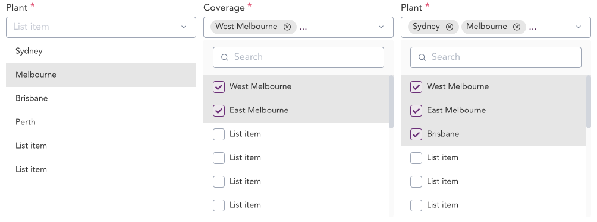
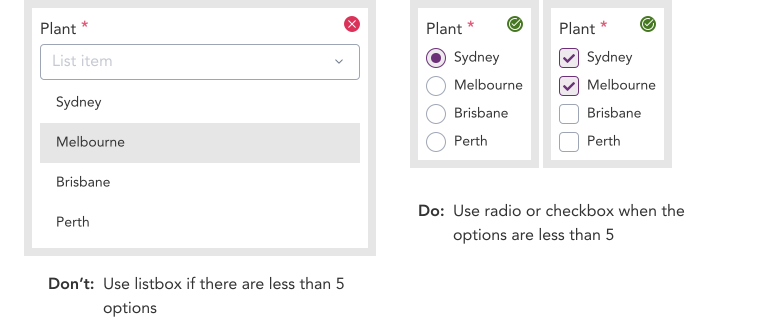

import AdmonitionExt from '../admonitionExt'

> Listbox are lists of items grouped together. List items in a listbox can be either grouped or ungrouped. They can also have checkboxes as a variant allowing users to select multiple items at once.

## Variants

A total of 8 variants of listboxes are available in GEL. 4 with checkboxes and 4 without.

## Demo

## Guidance

* Listbox in a single select input will close the Listbox after a value has been selected from the option.
* Listbox in a multi select input will close the Listbox after the user has clicked anywhere outside the Listbox dialog.
* When user searches for a value in the listbox, the list should be filtered to match the search value.

### When to use

* Listbox are used to display multiple options for a select input.

### When no to use

* If the options withing the panel or dropdown performs actions, consider using a menu instead.
* If the options to be displayed are less than 5, consider using [checkbox](checkbox.md) or [radio button](radio.md) group instead of a select with listbox(combobox).

### Consideration

## Designer assets

<AdmonitionExt type="figma" url="https://www.figma.com/file/kzLxtqv6YGL0wotiqzgEo4/GEL-UI-Doc?node-id=696%3A97231" />

## Developer API

<AdmonitionExt type="vue" url="https://primefaces.org/primevue/listbox" />