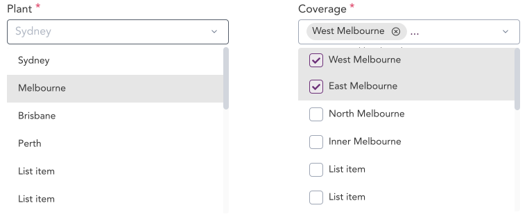

> Listbox are lists of items grouped together. List items in a listbox can be either grouped or ungrouped. They can also have checkboxes as a variant allowing users to select multiple items at once.

## Variants

A total of 8 variants of listboxes are available in GEL. 4 with checkboxes and 4 without.

:::info Figma

See all the available variants of listbox by clicking [here](https://www.figma.com/file/kzLxtqv6YGL0wotiqzgEo4/GEL-UI-Doc?node-id=696%3A97231)

:::
:::info Code

Find the source code [here](https://primefaces.org/primevue/listbox)

:::

## Demo

## Guidance

* Listbox in a single select input will close the Listbox after a value has been selected from the option.
* Listbox in a multi select input will close the Listbox after the user has clicked anywhere outside the Listbox dialog.
* When user searches for a value in the listbox, the list should be filtered to match the search value.

## When to use

* Listbox are used to display multiple options for a select input.