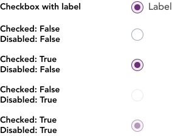
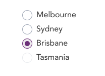

import AdmonitionExt from '../admonitionExt'

> A radio is an input control that allows a user to select one options from number of choices.

## Variants

There are a total of 5 variants of radio button availabe in GEL. 

## Demo

## Guidance

* Similar to checkboxes, radio buttons ideally should be stacked vertically, however can be horizontally placed if the width is sufficient.
* All radio should be followed by text in a from.
* One radio button should be selected by default using the checked attribute.
* Users are able to select an option by clicking/tapping either the radio button or its label.

### When to use

* Use radio buttons to present a set of options, where only one option can be selected at a time.

### When not to use

* If the options provided are more than 5, consider using a [Select](select.md) instead.

## Designer assets

<AdmonitionExt type="figma" url="https://www.figma.com/file/kzLxtqv6YGL0wotiqzgEo4/GEL-UI-Doc?node-id=696%3A97980" />

## Developer API

<AdmonitionExt type="vue" url="https://primefaces.org/primevue/radiobutton" />