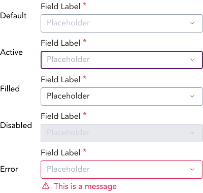
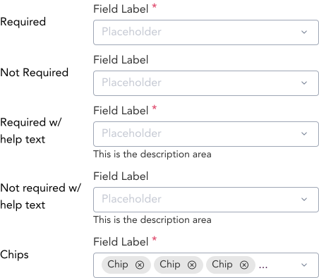
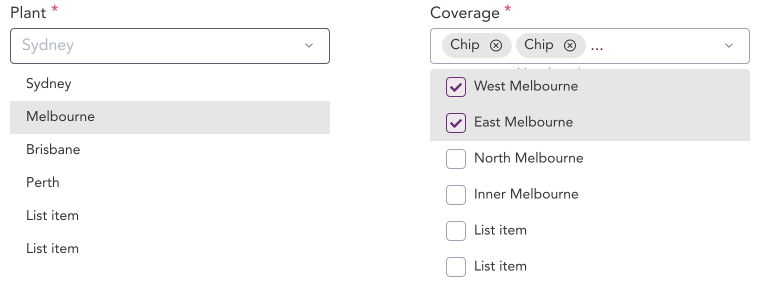

import AdmonitionExt from '../admonitionExt'

> Select inputs are dropdown inputs used when there are multiple options available for a single input field.

## Variants

There are a total of 20 input variations to choose from. They are primarily divided into 4 different states (Default, Active, Disabled, and Error) of inputs.

| States | Sub States|
| ---    | ---       |
|  |  |

## Demo

## Guidance

* Select are dropdowns used inside form. 
* A listbox is always opened when a select is triggered/clicked.
* In multselect listbox, the selection made by the use are reflected as chips. A “...” appends the chips list if the multi selected options do not fit in the select area.
* Labels, Required, Placeholders, Inline messages and Help text guidance same as in Inputs.
* Use Select if the selection options are more than 5. If less than 5 options, consider using a Radio/Checkboxes.

## When to use

* Use Select inside forms when the input field requries selection to be made from multiple options.

## Designer assets

<AdmonitionExt type="figma" url="https://www.figma.com/file/kzLxtqv6YGL0wotiqzgEo4/GEL-UI-Doc?node-id=696%3A97638" />

## Developer API

<AdmonitionExt type="vue" url="https://primefaces.org/primevue/multiselect" />