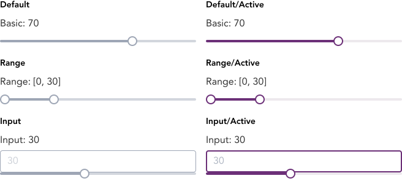
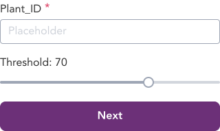

> Slider is an input component to provide a numerical input. It allows users to choose an approximate value on a slider.

## Variants

A total of 6 variants of sliders are available in GEL.

:::info Figma

See all the available variants of slider by clicking [here](https://www.figma.com/file/kzLxtqv6YGL0wotiqzgEo4/GEL-UI-Doc?node-id=696%3A97315)

:::
:::info Code

Find the source code [here](https://primefaces.org/primevue/slider)

:::

## Demo

## Guidance

* Slider is to be used as an input for selecting a value against the slider provided.
* The number corresponding to the place of the slider button should be displayed in the textarea either in single number or range format.
* Active state is triggered when the user slides the range selector or inputs value into the input box

## When to use

* Slider should be used in occasions that require a UI reflecting the value user selects.