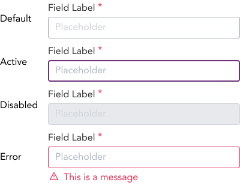
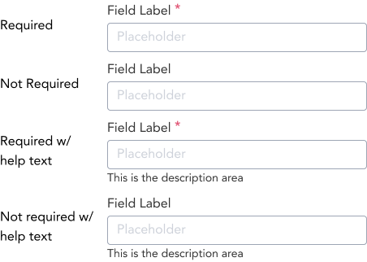
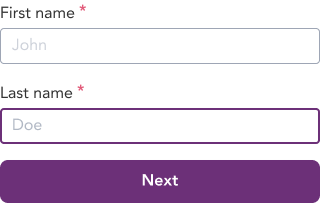

> Inputs are the most basic component for capturing and submitting user data.

## Variants

There are a total of 32 input variations to choose from. They are primarily divided into 4 different states (Default, Active, Disabled, and Error) of inputs.

| States | Sub States|
| ---    | ---       |
|  |  |

See all the available variants of input by clicking [here](https://www.figma.com/file/kzLxtqv6YGL0wotiqzgEo4/GEL-UI-Doc?node-id=696%3A97503)

## Demo

## Guidance

* Use inputs when the user needs to provide value to the form.
* Avoid using inputs that trigger immediate change: a page refresh.
* Label: Labels in an input field informs the user what the field is used for.
* Required: Required option in an input informs the user if the field is mandatory.
* Placeholder: Placeholders in addition to labels allows providing additional information to the user in regards to what the input field is being used for.
* Inline Message: These messages are displayed upon the validation of the input fillled ideally an error message is displayed on a much frequent basis.
* Help Text: Help Text provide user with further explanantion of the input field. Help text can be a small paragraph.

## When to use

* Use Inputs when the user has to put in a value inside a form.