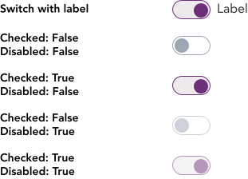

import AdmonitionExt from '../admonitionExt'

> A switch is a boolean input taking either true or false values only.

## Variants

There are a total of 5 variants of switch availabe in GEL. 

## Demo

## Guidance

* When used for infographics or tables, the result of changing the switch is immediately effective and there is no need for an additional action to apply or save a change.
* Use switch if there are no more than two choices mapping to boolean relationship like true or false.
* Consider providing feedback of the toggle state change by using a [toast](../message/toast.md).

### When to use

* Use switch in instances where the input requires a boolean relaionship like on/off, true/false, enable,disable or activate/deactivate.
* The view

### When not to use

* If a submit button is required to apply the selection, please do not use switch as the application of switch is immediate.
* If multiple items can be selected, including nested items, and the result of the selectio nhas to be saved or submitted, consider using a [checkbox](checkbox.md) instead.
* If only one itme can be selected and the result of the selection has to be saved or submitted, consider using a [radio button](radio.md) instead.
* If making a selection from a list of items, consider using a [listbox](listbox.md) instead.
* If changing a content view or preference in the context of that content, consider using a [segmented control](../control-buttons/segmented-control.md) instead.

## Designer assets

<AdmonitionExt type="figma" url="https://www.figma.com/file/kzLxtqv6YGL0wotiqzgEo4/GEL-UI-Doc?node-id=696%3A98031" />

## Developer API

<AdmonitionExt type="vue" url="https://primefaces.org/primevue/radiobutton" />