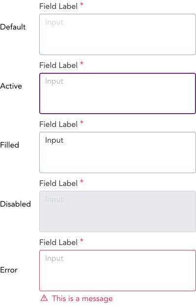

> A text area includes a label and a longer area you can type multiple lines of text into.

## Variants

There are a total of 16 textarea to choose from. They are primarily divided into 4 different states (Default, Active, Disabled, and Error) of inputs.

| States | Sub States|
| ---    | ---       |
|  |  |

:::info Figma

See all the available variants of textarea by clicking [here](https://www.figma.com/file/kzLxtqv6YGL0wotiqzgEo4/GEL-UI-Doc?node-id=696%3A97740)

:::
:::info Code

Find the source code [here](https://primefaces.org/primevue/inputnumber)

:::

## Demo

## Guidance

* A textarea is ideally resizable by default. The textarea can also be non resizable as per the requirement.
* Textarea and Editor are similar. However, they differ in the fact that Editro allows user to format the text. Consider using Editor is such scenarios requiring text formatting.
* Labels, Required, Placeholders, Inline messages and Help text guidance same as in Inputs.

## When to use

* Use textarea to capture user inputs in the form of messages or long texts. 
* Inputs that allow user to write small paragraphs without formatting should be ideal situation to use textarea.