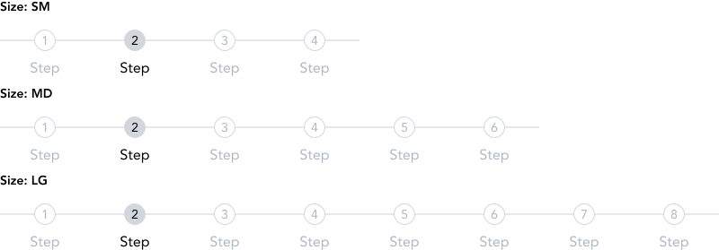
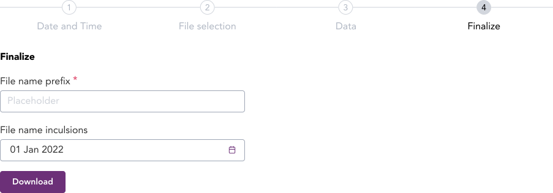

import AdmonitionExt from '../admonitionExt'

> Steps component is an indicator for steps in a wizard workflow.

## Variants

There are 3 different sized varients of steps provided in GEL. Default(SM), MD and LG.

## Demo

## Guidance

* Steps are used when the user are not regular to the process/workflow and require assistance to complete the workflow.
* Steps allows user to fill in data one by one before moving to another step in the the workflow.
* When using steps, make sure the steps are not very long. A 15 step wizard would not be intuitive for the user to go through.
* Refrain from using a step component inside another step. The process should be for only one end result.

### When to use

* Use steps when the workflow is new for the user or occasional.
* Use steps as indicator of a user's progress within a process, i.e, in a checkbout flow.

## Designer assets

<AdmonitionExt type="figma" url="https://www.figma.com/file/kzLxtqv6YGL0wotiqzgEo4/GEL-UI-Doc?node-id=618%3A56732" />

## Developer API

<AdmonitionExt type="vue" url="https://primefaces.org/primevue/breadcrumb" />