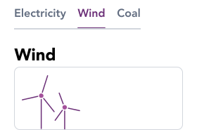

import AdmonitionExt from '../admonitionExt'

> Tabs are used to organize content by grouping similar information on the same page.

## Variants

There are a total of 6 variations of Tabs to choose from in GEL.

## Demo

## Guidance

* A tab reveals associated content when activated.
* Only one tab can be active at a time.
* Tabs should not be confused with navigation. Tabs help user remain in the same context while navigation changes the context.

## When to use

* Tabs are used to show one content section at a time while maintaining a view of related options.

## Designer assets

<AdmonitionExt type="figma" url="https://www.figma.com/file/kzLxtqv6YGL0wotiqzgEo4/GEL-UI-Doc?node-id=2%3A35060" />

## Developer API

<AdmonitionExt type="vue" url="https://primefaces.org/primevue/tabmenu" />