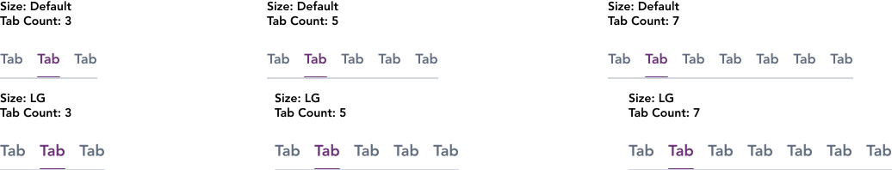

import AdmonitionExt from '../admonitionExt'

> Tabs are used to organize content by grouping similar information on the same page.

## Variants

There are a total of 6 variations of Tabs to choose from in GEL.

## Demo

## Guidance

* A tab reveals associated content when activated.
* Only one tab can be active at a time.
* The large variation of tabs are page level provided by the template. The smaller default sized tabs can be used for content level tabs.

### When to use

* Tabs are used to show one content section at a time while maintaining a view of related options.

### When not to use

* If content is part of a flow, consider using the [steps](steps.md) component instead.
* Avoid confusing tabs with navigation links. Tabs help users remain in the same context; use navigation [link](../buttons-and-links/links.md) for changing context.

## Designer assets

<AdmonitionExt type="figma" url="https://www.figma.com/file/kzLxtqv6YGL0wotiqzgEo4/GEL-UI-Doc?node-id=2%3A35060" />

## Developer API

<AdmonitionExt type="vue" url="https://primefaces.org/primevue/tabmenu" />