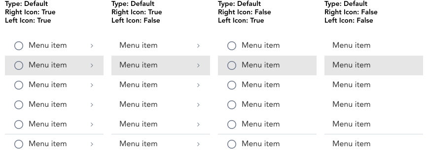
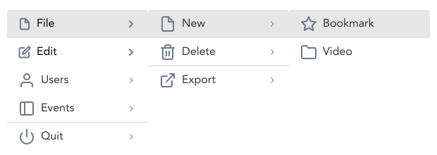

import AdmonitionExt from '../admonitionExt'

> Tiered Menus displays submenus in a nested overlays.

## Variants

There are a total of 4 variations of Tiered menu to choose from in GEL.

## Demo

## Guidance

* If menu items or navigation items have multiple options grouped into a single parent option, the tiered menu should be used.
* Differing from listbox, tiered-menu items are actionabel items rather than selection options. So clicking an item in a tiered menu will trigger an action just like a CTA.
* Upto 3 levels of overlays can be displayed at any time.
* The menu items can be grouped together separated by a divider.

### When to use

* Use tiered menu for navigational scenarios requiring grouped menu item.

### When not to use

* If the items displayed upon clicking the button is list of options for selection, consider using a [select](../forms/listbox.md) instead.

## Designer assets

<AdmonitionExt type="figma" url="https://www.figma.com/file/kzLxtqv6YGL0wotiqzgEo4/GEL-UI-Doc?node-id=618%3A57266" />

## Developer API

<AdmonitionExt type="vue" url="https://primefaces.org/primevue/tieredmenu" />