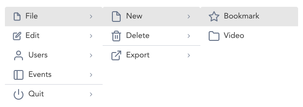

> Tiered Menus displays submenus in a nested overlays.

## Variants

There are a total of 4 variations of Tiered menu to choose from in GEL.

:::info Figma

See all the available variants of tired menu by clicking [here](https://www.figma.com/file/kzLxtqv6YGL0wotiqzgEo4/GEL-UI-Doc?node-id=618%3A57266)

:::
:::info Code

Find the source code [here](https://primefaces.org/primevue/tieredmenu)

:::

## Demo

## Guidance

* If menu items or navigation items have multiple options grouped into a single parent option, the tiered menu should be used. 
* Upto 3 levels of overlays can be displayed at any time.

## When to use

* Navigations scenarios requiring grouped menu item