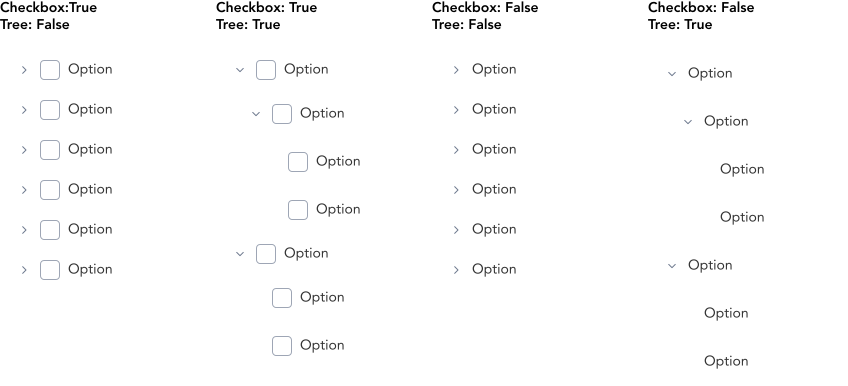
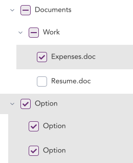

> Trees are used to display hierearchical data.

## Variants

There are a total of 4 variations of Trees to choose from in GEL.

:::info Figma

See all the available variants of tired menu by clicking [here](https://www.figma.com/file/kzLxtqv6YGL0wotiqzgEo4/GEL-UI-Doc?node-id=618%3A57225)

:::
:::info Code

Find the source code [here](https://primefaces.org/primevue/tree)

:::

## Demo

## Guidance

* A tree follows a top-down pattern and each consecutive nested node (level) is indented to communicate the hierarchy.
* In trees with checkboxes, checking the parent node selects the entire node content inside.

## When to use

* Create hiereachical structures to view and access parent and child nodes.