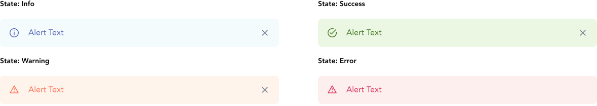
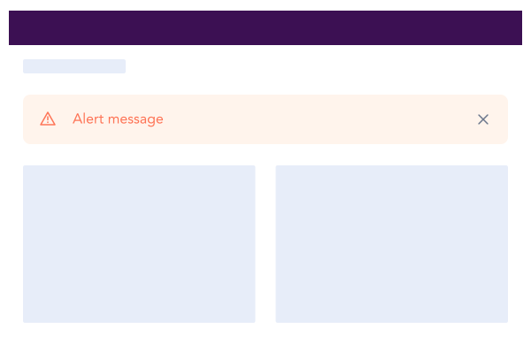

import AdmonitionExt from '../admonitionExt'

> Alert is a page level message residing at the start of the content. Also known as message in PrimeVue.

## Variants

There are 4 different sized varients of alerts provided in GEL. Info, Success, Warning and Error

## Demo

## Guidance

* Alert is generally in page level with the second highest priority after [banner](banner.md).
* An alert ideally sits underneath the page heading above all the content for that particular page as displayed in the demo above.
* An alert can be used in combination with from validation to help users remedy errors.

### When to use

* Use alert to advise the user that they should be aware of, or address something related to their current context.
* Educate the user about new or unused feature, or information related to their current context.

### When not to use

* If you are immediately confirming a user's action while they remain in the same view, use a [toast](toast.md) instead.
* If you are promoting, soliciting feedback, or informing a user about a feature, use a [banner](banner.md) instead.

## Designer assets

<AdmonitionExt type="figma" url="https://www.figma.com/file/kzLxtqv6YGL0wotiqzgEo4/GEL-UI-Doc?node-id=664%3A63922" />

## Developer API

<AdmonitionExt type="vue" url="https://primefaces.org/primevue/message" />