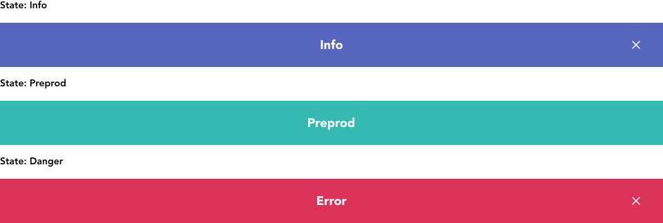

import AdmonitionExt from '../admonitionExt'

> Banner are page level messages provided to the user.

## Variants

There are 3 different sized varients of banners provided in GEL. Info, Preprod and Danger

## Demo

## Guidance

* Banner should always be the first item on the page when displayed.
* Banners are non closable in behaviour meaning they remain at the top of the page until the entirety of the frame.

### When to use

* Use banner when user would require information about the page at the top level.

### When not to use

* If you need to communicate that a feature hasn't been configured or used, consider using an empty state instead.
* If you need to communicate status of the contents of the page, consider using an [alert](alert.md) instead.

## Designer assets

<AdmonitionExt type="figma" url="https://www.figma.com/file/kzLxtqv6YGL0wotiqzgEo4/GEL-UI-Doc?node-id=661%3A63590" />

## Developer API

:::caution Code

Banner is a custom component specific to GEL and is not available in PrimeVue.

:::