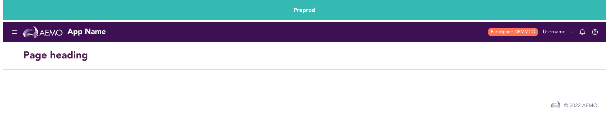

> Banner are page level messages provided to the user.

## Variants

There are 3 different sized varients of banners provided in GEL. Info, Preprod and Danger

:::info Figma

See all the available variants of tired menu by clicking [here](https://www.figma.com/file/kzLxtqv6YGL0wotiqzgEo4/GEL-UI-Doc?node-id=661%3A63590)

:::
:::caution Code

Banner is a custom component specific to GEL and is not available in PrimeVue.

:::

## Demo

## Guidance

* Banner should always be the first itme on the page when displayed.
* Banners are non closable in behaviour meaning they remain at the top of the page until the entirety of the frame.

## When to use

* Use banner when user would require information about the page at the top level.