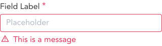

import AdmonitionExt from '../admonitionExt'

> Inline messages are ideally used as help text for from elements after validation.

## Variants

There are 4 different sized varients of inline messages provided in GEL. Info, Success, Warning and Danger

## Demo

## Guidance

* Inline messages should be displayed underneath the input fields/select/input numbers when validation fails for that component.
* One field can have a maximum of one inline message at any instance.

## When to use

* Use inline messages to inform the user of validations applied to the form elements.

## Designer assets

<AdmonitionExt type="figma" url="https://www.figma.com/file/kzLxtqv6YGL0wotiqzgEo4/GEL-UI-Doc?node-id=664%3A64276" />

## Developer API

:::caution Code

Inline message is a custom component specific to GEL and is not available in PrimeVue.

:::