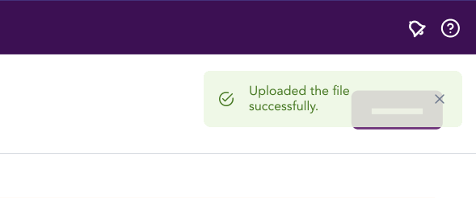

import AdmonitionExt from '../admonitionExt'

> Toast is used to display messages over the top of the conent as an overlay.

## Variants

There are 3 different sized varients of toast provided in GEL. Info, Success and Error.

## Demo

## Guidance

* Toast messages are displayed for a short amount of time and gets hidden after a short amount of time.
* Toast messages can also be closed manually by clicking the closing icon.
* All Toast messages should be accompanied with an icon and text.
* Multiple toast messages can be stacked like a list with gaps between the messages but never overlap each other. 

### When to use

* Use toast to provide contextual message based on a user's action in the same view the action took place.
* Use toast if the message can be displayed for a short amount of time.

### When not to use

* If you need to communicate an error to a user that impact the user from moving forward, consider using a danger or warning [alert](alert.md) instead.
* If there's a page refresh, or a message needs to be communicated after a user visits a new page, consider using an [alert](alert.md) instead.
* If the action is irreversible, consider using a modal instead.

## Designer assets

<AdmonitionExt type="figma" url="https://www.figma.com/file/kzLxtqv6YGL0wotiqzgEo4/GEL-UI-Doc?node-id=661%3A63832" />

## Developer API

<AdmonitionExt type="vue" url="https://primefaces.org/primevue/toast" />