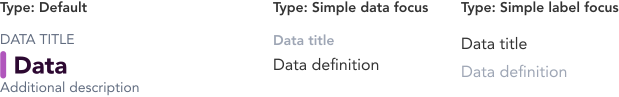

import AdmonitionExt from '../admonitionExt'

> Data points are discrete units of information presented to the user for visualization.

## Variants

There are 3 different types of data points available to choose from in GEL.

## Demo

## Guidance

* Data points should be used when data is to be visualized to the user.
* The data point can be dynamic and change with new data being provided by the system.

### When to use

* Use data point when the data is required to be displayed to the user in the simplest format.
* Use data point to display information related to one particular context.

### When not to use

* If the amount of data to be displayed is huge and requires an overarching view of all the records, consider using a [table](../tables/table.md) instead.

## Designer assets

<AdmonitionExt type="figma" url="https://www.figma.com/file/kzLxtqv6YGL0wotiqzgEo4/GEL-UI-Doc?node-id=2446%3A233909&t=TGRoM1Kxa2D9XZlV-4" />

## Developer API

:::caution Code

Status component is specific to GEL only and is not available in PrimeVue.

:::