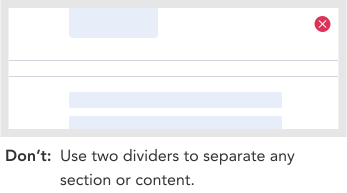

import AdmonitionExt from '../admonitionExt'

> Divider is a line that can divide the contents to create sections within a page.

## Variants

There are 2 orientation of divider available to choose from in GEL.

## Demo

## Guidance

* TBD When using divider, you can use it in between grid as required.

### When to use

* Use divider when you create different sections or visual separation within contents in a page.

### Consideration

## Designer assets

<AdmonitionExt type="figma" url="https://www.figma.com/file/kzLxtqv6YGL0wotiqzgEo4/GEL-UI-Doc?node-id=2448%3A137106&t=TGRoM1Kxa2D9XZlV-4" />

## Developer API

<AdmonitionExt type="vue" url="https://primefaces.org/primevue/divider" />