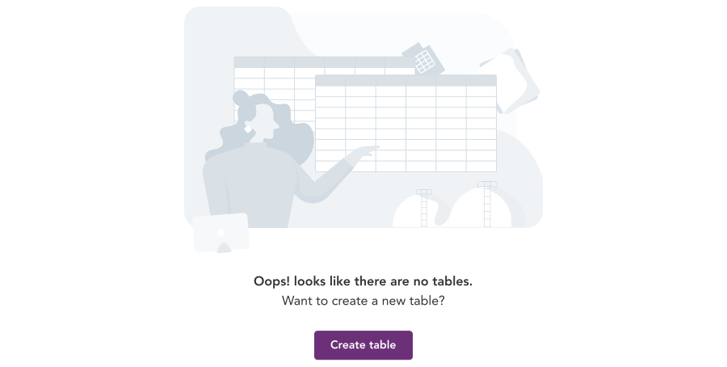
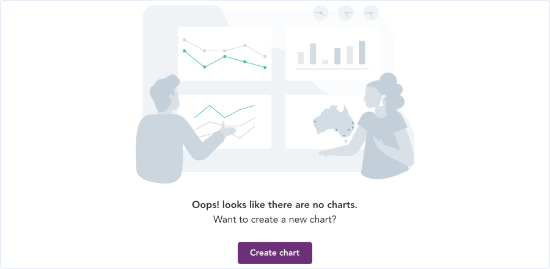
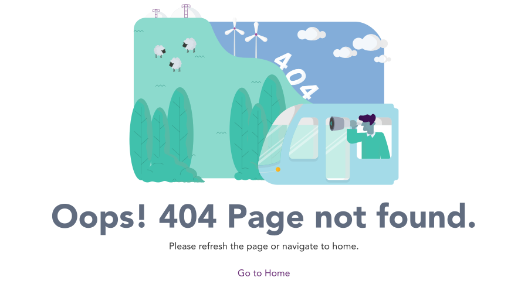
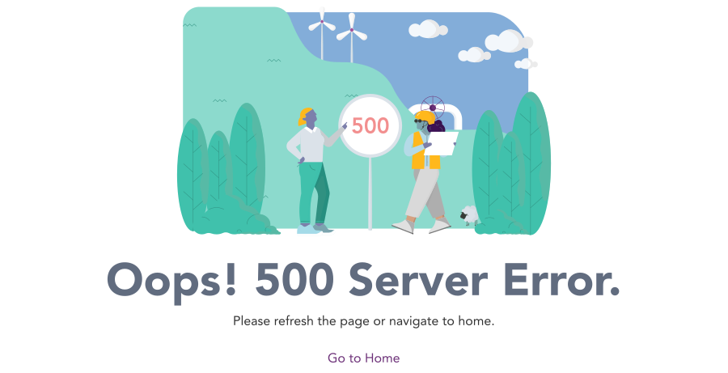
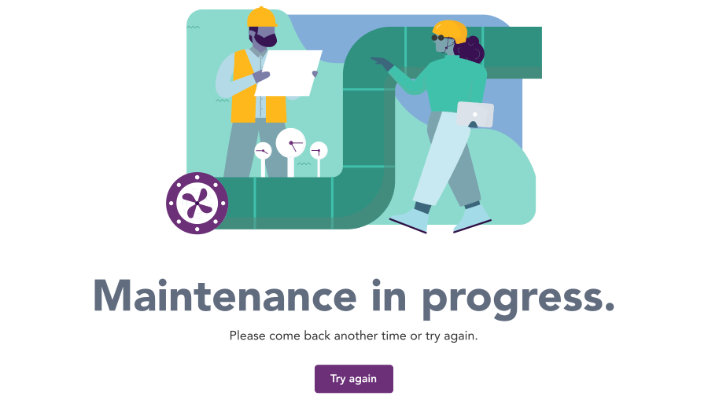
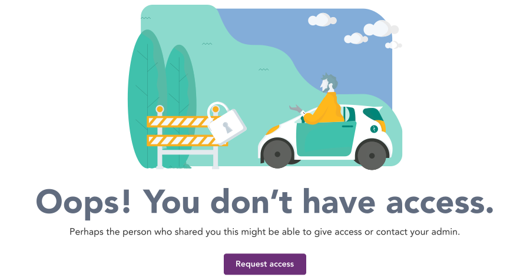
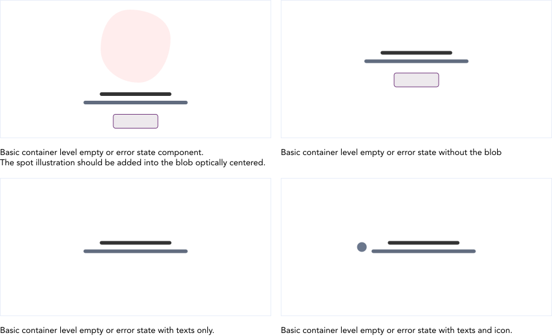
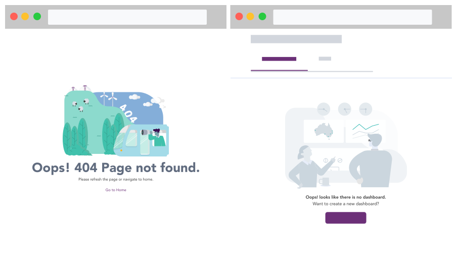
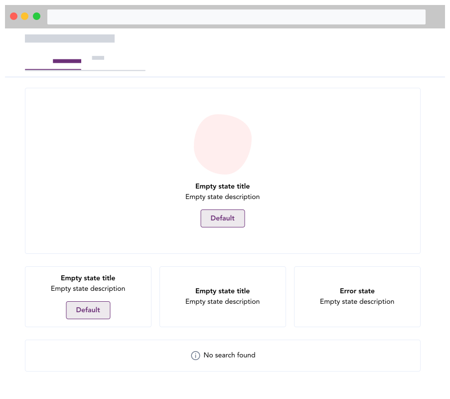

import AdmonitionExt from '../admonitionExt'

> Empty and error states in an app occur when there is either no data to display or when the user encounters an error. Despite being challenging, these situations present excellent opportunities to communicate what the user would see with data and offer helpful advice on what to do next.

## Page level states

Page level illustrations are when there are no data to be displayed in the entire page or there has been a service error that restricts the user from successfully applying an action. Page level illustrations are categorized into two different categories.
* Empty state
* Error state

<!-- *************** Empty state section *************** -->

## Empty state

Empty states are used when an element does not have content to display to the user. The empty state tells user what it is for and why they are seeing it. Effective empty states also tells user what to do next. The illustration that sits with an empty state informs the system state to the user. 

An empty state can occur for following reasons:

* There is no data for the user to see.
* A feature has not been configured yet. 

### Search

**When to use:** When there are no search data present.

### Dashboard

**When to use:** When the products dashboard is empty.

### Table

**When to use:** When there is  either no table or no data in a table

### Chart

**When to use:** When there are no charts to be displayed in infographics

### Notification

**When to use:** When there are no mail or notification

<!-- *************** Error Illustration section *************** -->

## Error state

Error illustration are empty states that enable us to manage errors when the user hits a roadblock. With error management illustrations, it provides user to recognize, diagnose and recover from error states. Guiding them with specific action item allows user to take next step diligently.

### 404

**When to use:** When the page does not exist or has been replaced.

### 500

**When to use:** When there has been a general problem with the server.

### Maintenance

**When to use:** To let the user know that a planned maintenance is in progress.

### Permission

**When to use:** When you do not have access to a file or link.

## Container level states

Container level empty or error states are when some parts of the product fails to load. In such scenarios, displaying basic empty or error state on specific containers allows user to still use the app but understand that an error has occured in a specific area only. Ensure that the message is relevant to the scenario and consize for the user. 

## Guidance

### Page level states

The following depicts the use case for error states. The entire screen is blank and corresponding error state is displayed. The action item guides user with the necessary steps to proceed further.

Consider the following when using the empty state and error state illustrations.
* Use a navigational link if the user is being navigated away from the page.
* Use a CTA button if an action can be performed within the page.

### Container level states

Using the default illustrations in multiple places only distracts the user from what needs to be done next. Use a basic empty state in such scenarios.

Consider the following when using multiple state
* Use spot illustrations that is relatable to the context to go with text and action item
* Use a secondary button sparingly to reduce busy UI filled with primary button

## Designer assets

<AdmonitionExt type="figma" url="https://www.figma.com/file/kzLxtqv6YGL0wotiqzgEo4/GEL-UI-Doc?node-id=1583%3A133034&t=wvR816gaBde6jnRE-4" />

## Developer API

:::caution Code

Empty state and error illustrations are specific to GEL only and is not available in PrimeVue.

:::