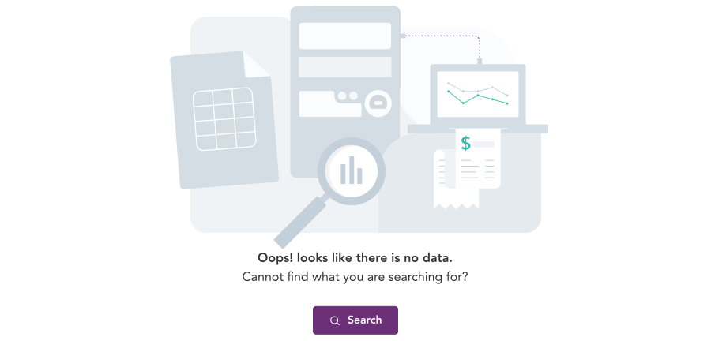
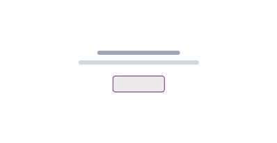

import AdmonitionExt from '../admonitionExt';
import Tabs from '@theme/Tabs';
import TabItem from '@theme/TabItem';

> Empty states in an app occur when there is no data to be displayed to the user. Despite being challenging, these situations present excellent opportunities to communicate what the user would see with data and offer helpful advice on what to do next.

The empty state tells user what it is for and why they are seeing it. Effective empty states also tells user what to do next. The illustration that sits with an empty state informs the system state to the user. 

An empty state can occur for following reasons:
* There is no data for the user to see.
* A feature has not been configured yet. 

## Types

An empty state can be dispalyed in two different levels.
* Page level
* Container level

### Page level

Page level empty state occurs when a user first lands on a new page, or after they have deleted, or removed all the content from a page. The primary purpose of this empty state is to guide or suggest the user on what actions can be taken to populate the page.

### Container level

Using the default illustrations in multiple places only distracts the user from what needs to be done next. Use a container level empty state in such scenarios.

## Variants

Page level empty states used are when there are no data to be displayed in the entire page. Few scenarios to use such empty states are when the page is blank, or configuration is required.

<Tabs>
<TabItem value="empty-search" label="Search" default>

**When to use:** When there are no search data present.

</TabItem>

<TabItem value="empty-dashboard" label="Dashboard">

**When to use:** When the products dashboard is empty.

</TabItem>

<TabItem value="empty-table" label="Table">

**When to use:** When there is  either no table or no data in a table

</TabItem>

<TabItem value="empty-chart" label="Chart">

**When to use:** When there are no charts to be displayed in infographics

</TabItem>

<TabItem value="empty-notification" label="Notification">

**When to use:** When there are no mail or notification

</TabItem>

<TabItem value="container-level" label="Container level">

**When to use:** When there are empty states on a container level 

</TabItem>
</Tabs>

## Guidance

### When to use

* Use an empty state when no content exists within a configured feature.
* The message used should be consize informing the use why the state is being diaplayed.
* Use a CTA button if an action can be performed within the page. This provides user the opportunity to act on how to reconsile the empty state.

#### Container level
* Use spot illustrations that is relatable to the context to go with text and action item.
* The spot illustration should be centered in the blob provided with horizontal padding of spacer-4.

* Use a secondary button sparingly to a reduce busy UI populated with primary button.
* Depending upon the availability of the space and number of empty states that might occur, following variations of container level empty state can be used.

|  |   |
| --- | --- |
| Container level with spot and action item | Container level without spot illustration |
|  | 
| Container level with icon and text | Container level with text only|

## Designer assets

<AdmonitionExt type="figma" url="https://www.figma.com/file/kzLxtqv6YGL0wotiqzgEo4/GEL-UI-Doc?node-id=1583%3A133034&t=wvR816gaBde6jnRE-4" />

## Developer API

:::caution Code

Empty state and error illustrations are specific to GEL only and is not available in PrimeVue.

:::