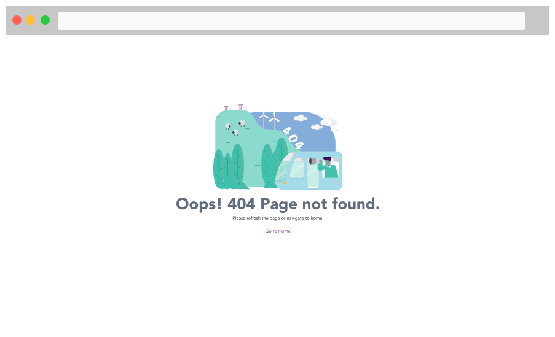
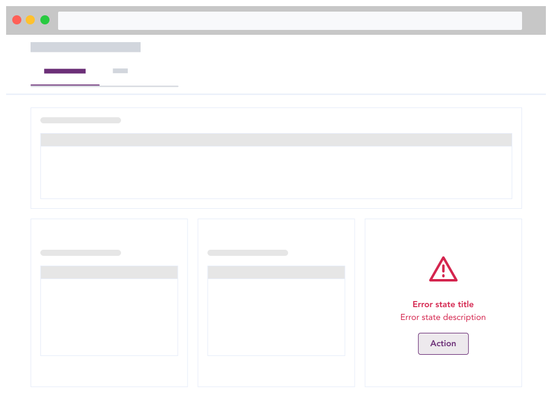
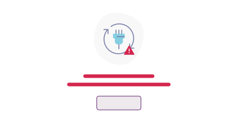
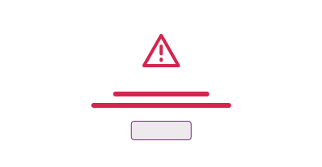
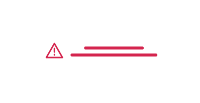

import AdmonitionExt from '../admonitionExt';
import Tabs from '@theme/Tabs';
import TabItem from '@theme/TabItem';

> Error states in an app occur when the user encounters either server error or non existent link to a certain content. Despite being challenging, these situations present excellent opportunities to communicate what the user would see with data and offer helpful advice on what to do next.

## Types

Similar to [empty states](./empty-state.md), error states can also be categorized into two categories.
* Page level
* Container level

### Page level

Page level illustrations are when there are no data to be displayed in the entire page or there has been a service error that restricts the user from successfully applying an action.

### Container level

Error can occur in smaller sections of a UI as we consider microtransactions. In such scenarios, container level error messages provide information on why a certain error occured and what remedy can be taken to overcome the error.

<!-- *************** Error Illustration section *************** -->

## Variants

Error illustration are empty states that enable us to manage errors when the user hits a roadblock. With error management illustrations, it provides user to recognize, diagnose and recover from error states. Guiding them with specific action item allows user to take next step diligently.

<Tabs>
<TabItem value="404" label="404" default>

**When to use:** When the page does not exist or has been replaced.

</TabItem>

<TabItem value="500" label="500">

**When to use:** When there has been a general problem with the server.

</TabItem>

<TabItem value="maintenance" label="Maintenance">

**When to use:** To let the user know that a planned maintenance is in progress.

</TabItem>

<TabItem value="permission" label="Permission">

**When to use:** When you do not have access to a file or link.

</TabItem>

<TabItem value="container-level" label="Container level">

**When to use:** When data fails to load in a specific section.

</TabItem>
</Tabs>

## Guidance

### When to use

* The entire screen is blank and corresponding error state is displayed. The action item guides user with the necessary steps to proceed further.
* Use a navigational link if the user is being navigated away from the page.
* Use a CTA button if an action can be performed within the page.

#### Container level states

* Depending upon the availability of the sections, number of errors might occur. Following variations of container level error state can be used.
* Using a common icon that indicates error should be used by itself, when or without spot illustration. 
* Spot illustrations are optional, but consider applying secondary colors when used.
* Text should be in red-500 as provided by included in the color system.

|         |     |
| --------------------------------------------------------- | ---------------------------------------------------------------   |
| Container level with spot and action item                 | Container level without spot illustration                         |
|  |  |
| Container level with icon and text                        | Container level with text only                                    |

## Designer assets

<AdmonitionExt type="figma" url="https://www.figma.com/file/kzLxtqv6YGL0wotiqzgEo4/GEL-UI-Doc?node-id=1583%3A133034&t=wvR816gaBde6jnRE-4" />

## Developer API

:::caution Code

Empty state and error illustrations are specific to GEL only and is not available in PrimeVue.

:::