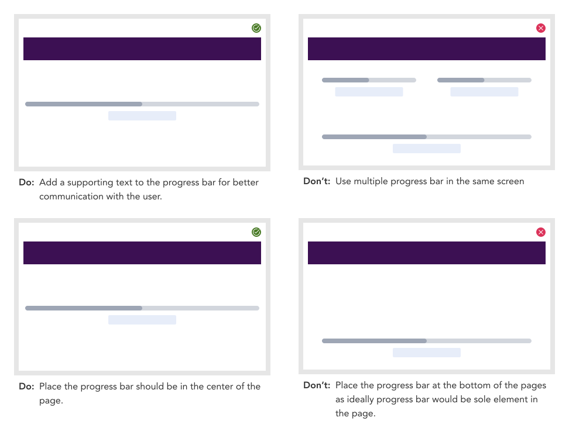

import AdmonitionExt from '../admonitionExt'

> A progress bar is a status indicator indicating the percentage of completion of a process.

## Variants

There are 3 different types of progress bars available to choose from in GEL.

## Demo

## Guidance

* User progress bar to indicate the percentage of completion of a process.
* Similar to spinner, in ideal scenario, there would be only one Progress bar at a time in a frame/screen.
* The progress bar component should be supported by visible text indicating what the bar is for, and the units of progress represented.

### When to use

* Scenarios to let user inform percentage of completion of a  process.

### When not to use

* If the amount of time or progress state cannot be calculate, consider using a [progress spinner](progress-spinner.md) instead.
* If you are loading a content after action has been completed and waiting to get the data, consider using a [skeleton](skeleton.md) instead.
* If running a wizard with discrete steps, consider using a [step](../menu/steps.md) instead.

### Consideration

## Designer assets

<AdmonitionExt type="figma" url="https://www.figma.com/file/kzLxtqv6YGL0wotiqzgEo4/GEL-UI-Doc?node-id=618%3A57134" />

## Developer API

<AdmonitionExt type="vue" url="https://primefaces.org/primevue/progressbar" />