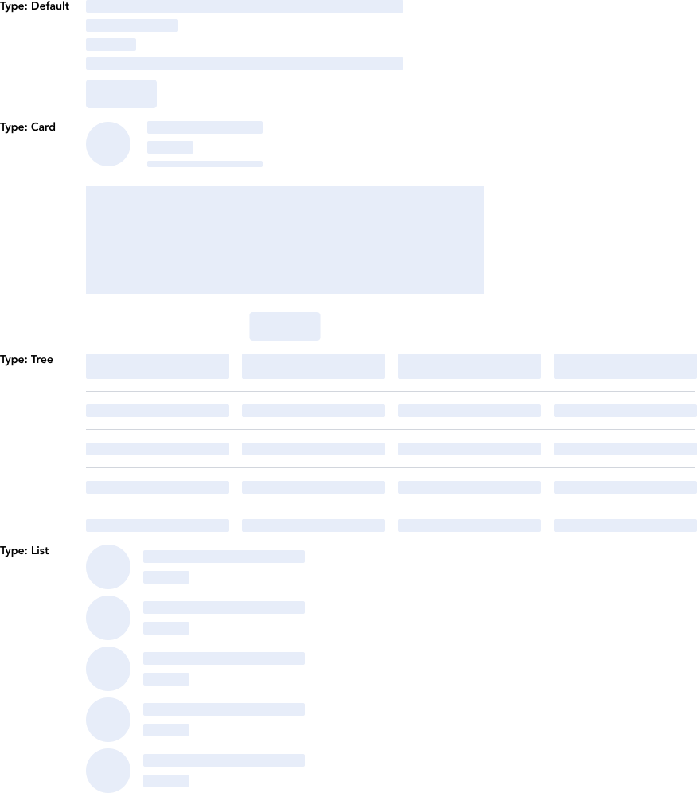
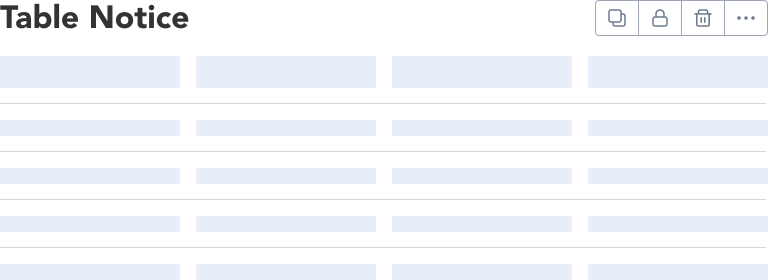

> Skeletons are loaders used as placeholders instead of actual content prior to being loaded completely.

## Variants

There are 4 different types of skeletons provided in GEL as MVP.

:::info Figma

See all the available variants of skeleton by clicking [here](https://www.figma.com/file/kzLxtqv6YGL0wotiqzgEo4/GEL-UI-Doc?node-id=618%3A56921)

:::
:::info Code

Find the source code [here](https://primefaces.org/primevue/skeleton)

:::

## Demo

## Guidance

* Avatars, cards, charts, content blocks, lists, and tables are good candidates for a skeleton state.
* Use rounded corners, even for rectangular shapes. Shapes follow the standard spacing guidelines.
* Each shape should represent content in a recognizable way. For example, a long rectangle for a line of text or a circle for an avatar.
* Instantly loading content doesn't need a skeleton loader.
* A skeleton loader shouldn’t be used in combination with a spinner, choose the one that fits the use case best.

## When to use

* Offer a simplified preview of loading content to help manage user expectations while decreasing perceived load time.