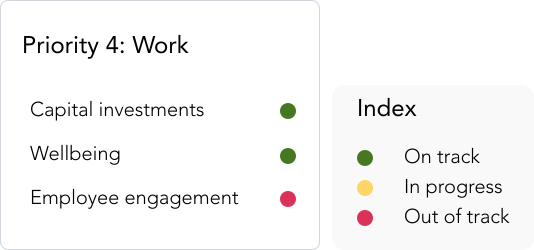

> Status is a small colored indicator for another element. 

## Variants

GEL provides 9 different status variants to be used in the system.

:::info Figma

See all the available variants of status by clicking [here](https://www.figma.com/file/kzLxtqv6YGL0wotiqzgEo4/GEL-UI-Doc?node-id=696%3A96238)

:::
:::caution Code

Status component is specific to GEL only and is not available in PrimeVue.

:::

## Demo

## Guidance

* Status component are to be used with index indicating the purpose of each colored status.

## When to use

* Use status to display the state of any particular element.