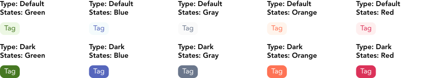
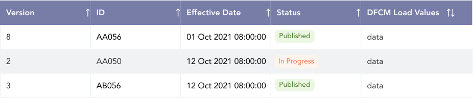

import AdmonitionExt from '../admonitionExt'

> Tag are visual indicator higlighting the state for quick recognition.

## Variants

GEL provides 10 different tags to be used in the system. 

## Demo

## Guidance

* A tag is static (non-interactive) by default.
* Tags can help categorize and organize the content based on the metadata provided by each data.
* Tags shouldn't be a standalone, floating element. If it can't be placed withing relationship to the object it supports, consider using another method that provides more context for the metadata.
* Avoid using long text strings inside a tag.

### When to use

* Use tag to highlight metadata that provides additional meaning to the primary element.

## Designer assets

<AdmonitionExt type="figma" url="https://www.figma.com/file/kzLxtqv6YGL0wotiqzgEo4/GEL-UI-Doc?node-id=696%3A95263" />

## Developer API

<AdmonitionExt type="vue" url="https://primefaces.org/primevue/tag" />