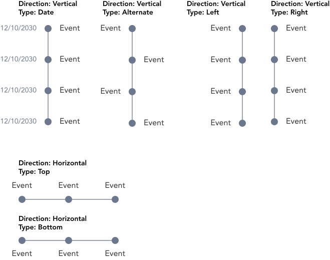

> Timline displays series of chained events.

## Variants

On the base there are two distinct variations of Timeline: horizontal and vertical with their variations of type.

:::info Figma

See all the available variants of timeline by clicking [here](https://www.figma.com/file/kzLxtqv6YGL0wotiqzgEo4/GEL-UI-Doc?node-id=618%3A56682)

:::
:::info Code

Find the source code [here](https://primefaces.org/primevue/timeline)

:::

## Demo

## Guidance

* The dots in the timeline component are not clickable.
* Spacing the events can be in accordane to the spacers provided by GEL. However the user may extend the spacing as required.

## When to use

* Use timeline to indicate chained or related events that can be tied together.