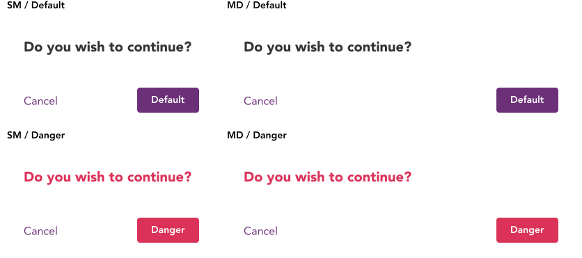
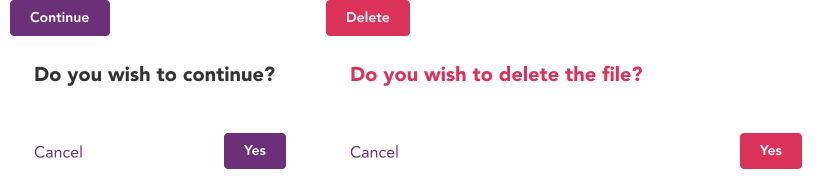
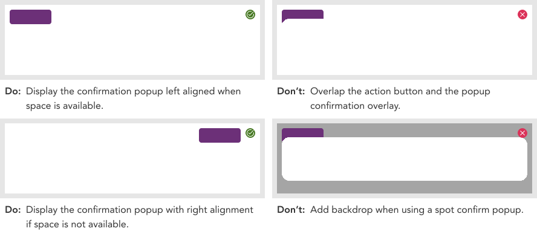

import AdmonitionExt from '../admonitionExt'

> Confirm popup displays a confirmation overlay displayed relatively to its target.

## Variants

There are 2 different confirm popups: Default and Danger with 2 different variants for each in terms of size.

## Demo

## Guidance

* Confirm popup should be used when the the confirmation can be displayed relative to the action button.
* Use “Spacer 1” gap between the action element and the confirmation popups.
* Dialog box and modals are of the highest elevation states in the system. Use “Elevation LG” for Confirmation popups.
* Start position of the popup should be left aligned to the action item.

### When to use

* Use confirm popup for confirming an action the user is about to take without interrupting any flow.
* When the user requires a spot action to a CTA.

### When not to use

* If the user requires uninterrupted attention and action must be taken before moving forward, consider using [modal](modal.md) instead.
* If the CTA doesn't require confirmation of any kind and just displaying additional actions, consider using other appropriate components such as [menu](tiered-menu)instead.

### Considerations

## Designer assets

<AdmonitionExt type="figma" url="https://www.figma.com/file/kzLxtqv6YGL0wotiqzgEo4/GEL-UI-Doc?node-id=636%3A63264" />

## Developer API

<AdmonitionExt type="vue" url="https://primefaces.org/primevue/confirmpopup" />