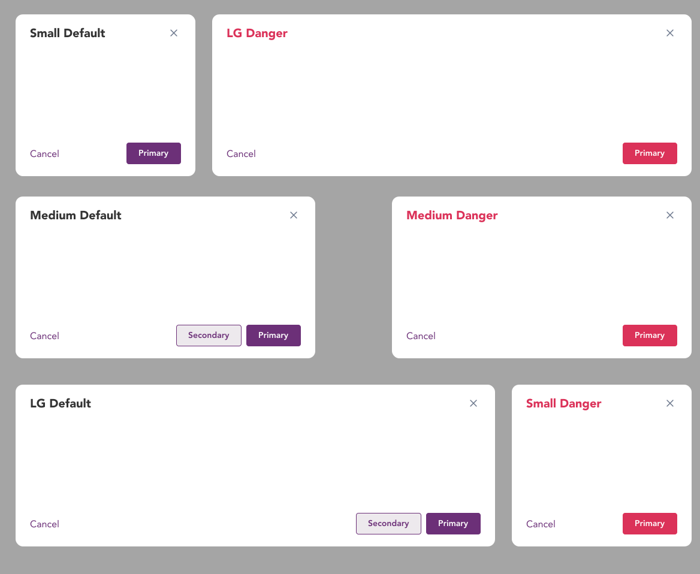
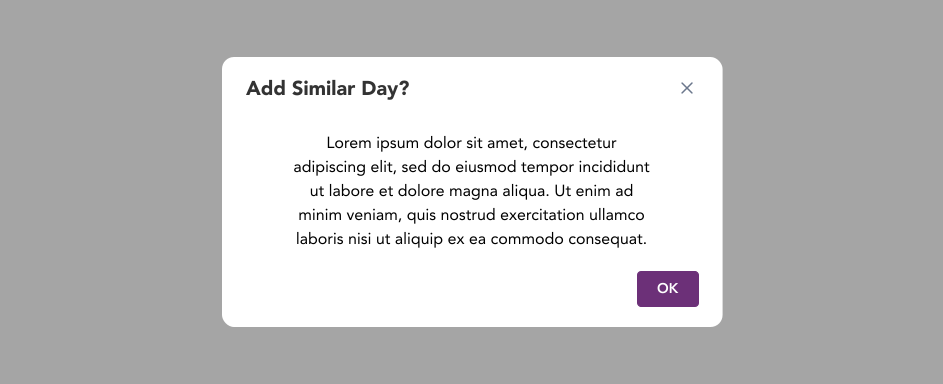

import AdmonitionExt from '../admonitionExt'

> A modal is used to reveal critical information, show information without losing context, or when the system requires a user response. 
> A modal is also named as *dialog* in PrimeVue, however, the funcitonality remains the same for both.

## Variants

There are two different modals: Default and Danger with 3 different variants for each in terms of size.

## Demo

## Guidance

* The header is either a question, a descriptive phrase, or title. The header also contains the close icon in every instance.
* The content in the body should never be ambiguous and unclear. Strive to be as concise as possible and provide the user with specific information in regards to their task.
* There should be no more than 3 actions and no fewer than 1. Actions should always be located within an action bar at the bottom of the modal.
* Modal should always open with a backdrop provided by GEL.

### When to use

* When the task requirers users input to be completed.
* To reveal critical information as contents inside the modal without losing the context.
* Confirmation leads to non-revertible destruction action.

### When not to use

* If the triggered action is confirmation only and user attention is not high, consider using a [confirm popup](confirm-popup.md) instead.
* When content can be displayed inline that does not require user action, consider using [popover](popover.md) or [tooltip](tooltip.md).
* If you need to deliver a brief, auto-expiring element for a user to consume while staying focused on their task, use a [toast](../message/toast.md) instead.

## Designer assets

<AdmonitionExt type="figma" url="https://www.figma.com/file/kzLxtqv6YGL0wotiqzgEo4/GEL-UI-Doc?node-id=6%3A16858" />

## Developer API

<AdmonitionExt type="vue" url="https://primefaces.org/primevue/dialog" />