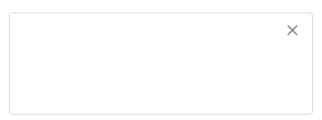

import AdmonitionExt from '../admonitionExt'

> Popover are similar to tooltip but varies in the fact that Popover can have multi line information about the target element.

## Variants

GEL provides designers with a popover that is displayed next to the help icon.

## Demo

## Guidance

* Popover should be used in conjunction with the help icon to provide extended information for the target element.
* The informatin provided in a popover is not necessarily critical for the user to act upon.
* Popover is an actionable overlay, therefore requiring user to click the icon to dipslay the popover.
* Popover can be dismissed by either clicking the close icon that comes with the component or when clicking outside.

### When to use

* When you don’t want to lose the context but still would like to provided extended information to the user.
* Should be used to provide short summaries about the target element.

### When not to use

* Use [tooltip](tooltip.md) if its not multiline and requires no extra information.
* Consider using [modal](modal.md) if you are displaying critical information that require action to complete the task.

### Consideration

## Designer assets

<AdmonitionExt type="figma" url="https://www.figma.com/file/kzLxtqv6YGL0wotiqzgEo4/GEL-UI-Doc?node-id=8%3A29775" />

## Developer API

:::caution Code

Popover component is specific to GEL only and is not available in PrimeVue.

:::