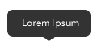
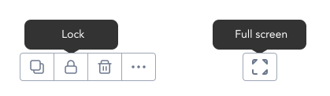

> Tooltip directive provides advisory information for a component.

## Variants

GEL provides designers with a tooltip that is displayed at the top of any element`

:::info Figma

See all the available variants of tooltip by clicking [here](https://www.figma.com/file/kzLxtqv6YGL0wotiqzgEo4/GEL-UI-Doc?node-id=8%3A29936)

:::
:::info Code

Find the source code [here](https://primefaces.org/primevue/tooltip)

:::

## Demo

## Guidance

* Tooltip should be as short as possible, ideally a one liner and single line.
* Tooltip should be displayed in hover state.
* Tooltip should be at a gap of spacer-2 with the element.
* Actionable icons/toolbar which does not have a accompanying text should have tooltip added to the icons/toolbar.
* Should remain in place when user moves cursor within the target element.
* Should have a delay of 500ms to help confirm hover intent.
* The text inside a tooltip should always be center aligned.

## When to use

* Use tooltip when an element requires additional information.