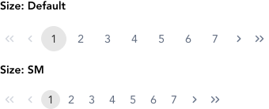
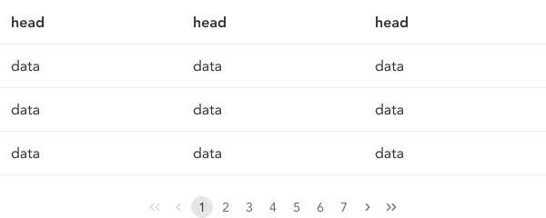

import AdmonitionExt from '../admonitionExt'

> Pagination is a generic component to display content in paged format.

## Variants

There are 2 sizes pagination available in GEL: Default and SM.

## Demo

## Guidance

* Ideally pagination should be used in tables only regardless of whether the table is page level or spot level.
* Pagination should be centrally aligned and floated at the bottom of the viewport and not immediately after the end of the last row of the table.
* Since pagination is a form of navigation, wrapping this in a `<nav>` element with adding aria-label is strongly suggested for accessibility purpose.
* Use the default pagination on page level tables while smaller tables (secondary tables) can use the smaller pagination.
* Pagination can be omitted if the rows fit the viewport according to the use case.

## When to use

* To break up a list or a large content block into multiple pages that can be navigated sequentially or by choosing a specific page within the set.

## Designer assets

<AdmonitionExt type="figma" url="https://www.figma.com/file/kzLxtqv6YGL0wotiqzgEo4/GEL-UI-Doc?node-id=8%3A29659" />

## Developer API

<AdmonitionExt type="vue" url="https://primefaces.org/primevue/paginator" />