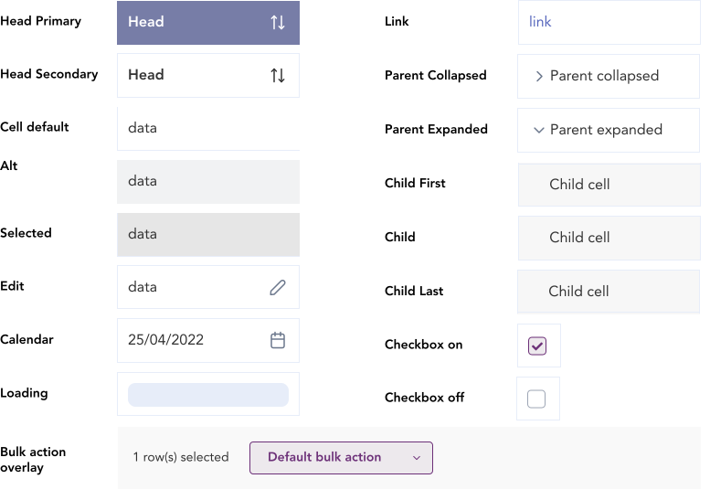
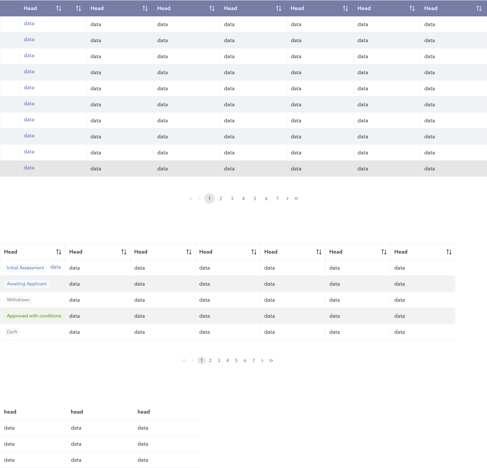

import AdmonitionExt from '../admonitionExt'
import Video from '../video'

> Table is visual representation to desplay data in tabular format.

## Variants

Users are provided with 2 different sized tables (SM and MD) in GEL or based on the context the user can create custom table by using the table cell blocks provided by GEL.

## Demo

## Guidance

* The building blocks of table can be pieced together to create a table.
* If the situation is sufficed with a table placehodler, consider using the two table components which would save time in return.
* A pagination element in a table is displayed at the bottom of the table component when displayed.
* Use [button control](../control-buttons/button-control.md) as table filters with the label floating when active or any value is selected.
* The following behaviour takes place when a filter is being selected for a table.
<Video source="../../../videos/filter-behaviour.mp4" />

* For bulk actions such as downloads and delete, a pop up should be displayed from the bottom with actionable items.
<Video source="../../../videos/bulk-action.mp4" />

### When to use

* Use table component to display the data in a tabular form.
* Use the building blocks if it requires the table to be custom made.

## Designer assets

<AdmonitionExt type="figma" url="https://www.figma.com/file/kzLxtqv6YGL0wotiqzgEo4/GEL-UI-Doc?node-id=6%3A17905" />

## Developer API

<AdmonitionExt type="vue" url="https://primefaces.org/primevue/datatable" />