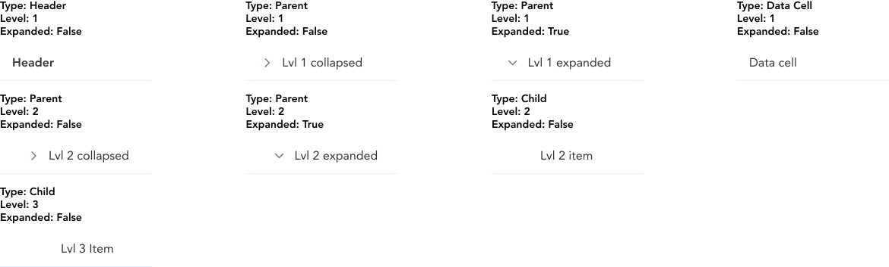
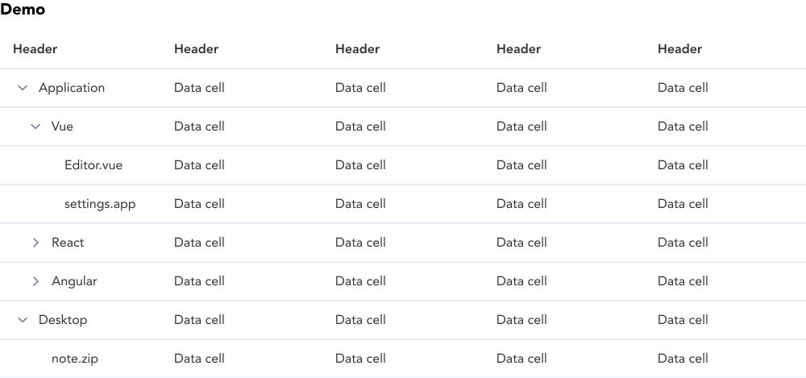

import AdmonitionExt from '../admonitionExt'

> Treetable is similar to a table but with hierarchical structure available to the data.

## Variants

Similar to table, treetable are provided as building blocks to create any kind of tables.

## Demo

## Guidance

* Treetable are similar to tables but with additional options to add hierarchy upto 3 levels.
* Data cell component is equivalent to level 1 item without hierarchy.
* Level 3 cannot have inner childs/hierarchy. 

## When to use

* Use treetables when there are usages of hierarchy/tree structure inside a table.

## Designer assets

<AdmonitionExt type="figma" url="https://www.figma.com/file/kzLxtqv6YGL0wotiqzgEo4/GEL-UI-Doc?node-id=618%3A56803" />

## Developer API

<AdmonitionExt type="vue" url="https://primefaces.org/primevue/treetable" />